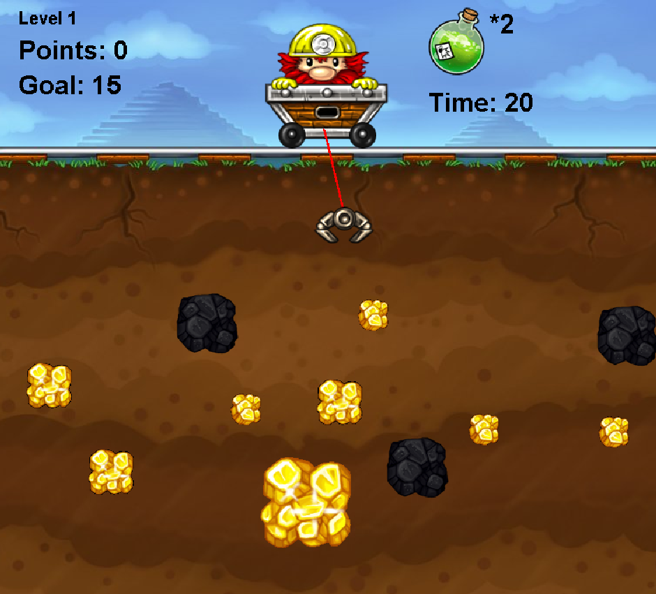

  

Gold Miner is a simplified version of the classic gold mining arcade game, developed in Java. The player control a character to mine gold and coals, progressing through infinite levels. After each level, the player can choose to buy a magic potion using their scores to speed up the process of pulling up golds and coals.

## Requirements
- Java 16
- IDE such as VSCode or IntelliJ IDEA.

## Quick Start
1. Clone the repository: `git clone https://github.com/your-username/gold-miner.git`
2. Open the project in your preferred IDE
3. Run the GameWin.java file to start the game

## How to play
**Left Click**: Drop the hook for mining gold or coal.  
**Right Click**: Use the magic potion to increase the speed of pulling up gold and coal.  
**Objective**: Gain enough scores to pass current level.  

🎮 **_Have fun and enjoy the game!_** ✨

